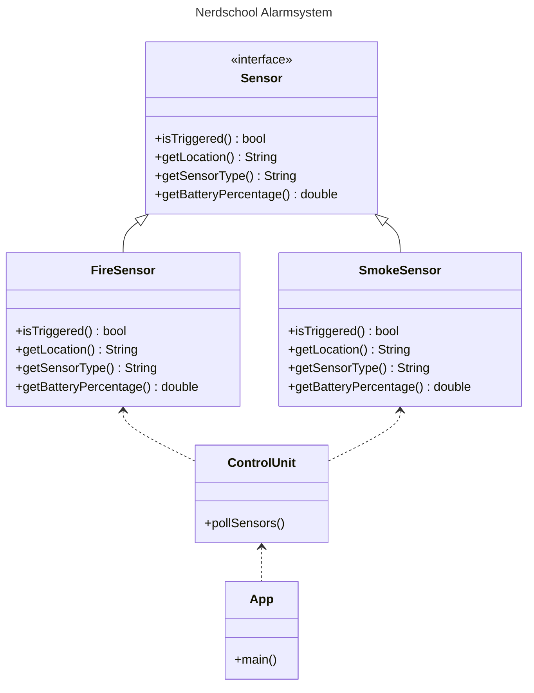

# 1.0 - Exercise 1 - Introduction

In these exercises we're going to make an Alarmsystem - the kind with fire and smoke detectors.

## 1.1 - The Alarm System :rotating_light:

Requirements:

- The system should support any number of sensors
- The system should support different types of sensors (fire, smoke, gas, etc)
- The system should poll all sensors to see if any are triggered (an alarm is raised)
- The system should also check for the battery percentage of the sensors (different types of sensors draines faster)

> Important! The goal of these exercises is to work on code with the SOLID principles in mind. Try to evaluate your choices as you go and keep the principles in mind.

## 1.2 - Getting started

> **Before you begin**: Please make sure that you have the following installed:

- IntelliJ Community Edition: [IntelliJ Community Edition](https://www.jetbrains.com/idea/download/)
- Java dev kit: [Java SE Development Kit](https://docs.oracle.com/en/java/javase/19/install/overview-jdk-installation.html)

1. :pencil2: Start by cloning this repository into a folder on your computer. If you've never used git before, you can alternatively use the the green "Code" button to the top right, and then select "Download zip". Unzip the downloaded zip file (make sure to remember where you put it).
2. :pencil2: Start IntelliJ and go `File -> Open -> select the POM.xml file in the 'alarmsystem' folder in the repository`. If IntelliJ asks, you want to select `Yes` for "Open as Project?" and "Keep existing project" for the second prompt. (See [IntelliJ docs](https://www.jetbrains.com/help/idea/maven-support.html#maven_import_project_start))
3. If IntelliJ prompts you to "Trust and Open Project", select `Trust Project` (See [IntelliJ Project Security](https://www.jetbrains.com/help/idea/project-security.html))
4. :pencil2: You should be able to compile the code and run all the existing unit tests.

### 1.2.3 Existing code

**Interfaces**

- `Sensor`. This interface defines methods for all sensors to implement.
	- `isTriggered()`: returns true/false for whether the sensor is triggered or not. Different sensors has different rules. See exercises.
	- `getLocation()`: returns a description of the location of the sensor such as "Lobby 1st floor" or "In the auditorium".
	- `getSensortype()`: returns a textual description of the sensor type such as "Fire sensor" or "Smoke sensor".
	- `getBatteryPercentage()`: Returns a number between 0-100 where 0 is empty and 100 is fully charged.

**Classes**

- `FireSensor`. This sensor implements the `Sensor` interface but has no logic yet.
- `SmokeSensor`. This sensor implements the `Sensor` interface but has no logic yet.
- `ControlUnit`. This is the starting point for the alarmsystem. It's the main entry point for polling sensors and controlling the system.
- `App` - Entrypoint for the application (where `main` method is located). Calls `pollSensors()` method in `ControlUnit` class.

### 1.2.4 - Running the application

:book: The `App` class contains the `main` method for the application. The application will prompt the user to input either "poll" (which calls `pollSensors()` on the `ControlUnit` class) or "exit" (which exits the application).

:pencil2: In order to start the application, Open upp the `App` class in the `Project` view on the left side of the screen. Then click the green arrow button at the top right of the screen or press <kbd>Shift</kbd> + <kbd>F10</kbd> (Windows) or <kbd>⌃ Control</kbd> + <kbd>R</kbd> (macOS).

:pencil2: To interact with the application, click on the terminal window in the `Run` window at the bottom of the screen.

:pencil2: Stop the app by pressing the red square button at the top right of the screen or press <kbd>CTRL</kbd> + <kbd>F2</kbd> (Windows) or <kbd>⌘ Command</kbd> + <kbd>F2</kbd> (macOS).

### 1.2.5 - :star: Optional - Unit tests

:exclamation: If you are not comfortable writing unit tests, you can safely skip this part.

:book: There are some initial unit tests in place: `FireSensorTest.java` and `SmokeSensorTest.java`. These are just dummy implementations to verify our starting template works out of the box as expected.

:book: When you work on your code you should keep the tests green, and that obviously means you will need to change them as you go along.

:book: Remember to change the test names (method names) so they reflect what the test is doing as you go along as well.

:book: The tests are just placeholders. Write better ones as you go along and remove the placeholder ones.

## 1.3 - `FireSensor`

:pencil2: Implement the `FireSensor` methods.

:exclamation: Requirements:

- Should raise an alarm every third time it is polled
- Drains 10% battery between each poll

:bulb: Hints:

- Add backing fields for all the get methods
- Add a separate backing field for tracking number of polls
- Increment this number each time the isTriggered method is called
- To implement the trigger logic, use the modulo operator in combination with the tigger count field

## 1.4. - `SmokeSensor`

:pencil2: Implement the `SmokeSensor` methods.

:exclamation: Requirements:

- Should raise an alarm every second time it is polled
- Drains 20% battery between each poll

### [Go to exercise 2 :arrow_right:](../exercise-2/README.md)
