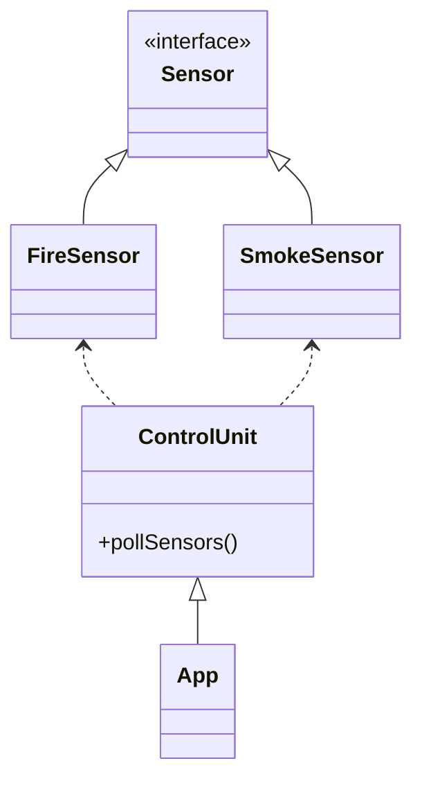
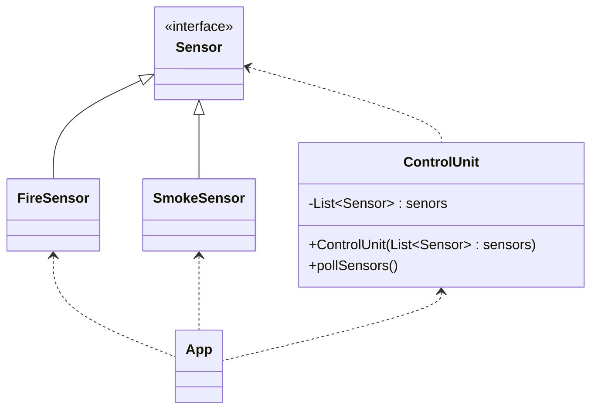

# 2.0 - Exercise 2 - Dependency Inversion Principle (DIP)

In this exercise we will look at how to apply the Dependency Inversion Principle (DIP) in code.

The Dependency Inversion Principle (DIP) states:

> Entities must depend on abstractions, not on concretions. It states that the high-level module must not depend on the low-level module, but they should depend on abstractions.

## 2.1 - Dependency Inversion Principle (DIP)



:pencil2: Take a look at the class diagram above showing the relationships between the different parts of the Alarmsystem application. (Dotted arrows denotes a dependency relation, full arrows denotes an inheritance relation (see [UML Class Diagrams Tutorial](https://www.visual-paradigm.com/guide/uml-unified-modeling-language/uml-class-diagram-tutorial/))).

:pencil2: The `pollSensors` method on the `ControlUnit` class currently knows which sensors (`FireSensor` and `SmokeSensor`) are registered in the system. This adds a thight coupling between the `ControlUnit` and the Sensor classes.

:pencil2: This thight coupling also violatetes the Open Closed Principle (OCP), because the `ControlUnit` class is not open for extension (eg. adding new types of sensors is not possible without changing the class).

:bulb: We want to apply the _Dependency Inversion Principle (DIP)_ in order to make the `ControlUnit` oblivious to which type of sensor it administers.

:book: When we introduce this kind of [loose coupling](https://en.wikipedia.org/wiki/Loose_coupling), the `ControlUnit` class is not prone to change as the Sensor class changes. E.g. we can add new sensor types without changing the `ControlUnit` class. As long as the different types of sensors adhere to the interface of how a sensor should behave. The ControlUnit class no longer has a direct dependency to the different sensor types, instead it only knows the behaviour of a sensor.

:book: A common way to implement DIP is via [_constructor injection_](https://en.wikipedia.org/wiki/Dependency_injection#Constructor_injection).  See the following class diagram:



:book: Notice that `ControlUnit` no longer has any relationship to `FireSensor` and `SmokeSensor`, only the `Sensor` interface. Instead, the `App` class now controls what sensors the `ControlUnit` polls via a new constructor.

:pencil2: Create a new constructor for the `ControlUnit` class that takes a list of `Sensor`s as a parameter. Store the list of sensors as a private instance variable inside the class.

:pencil2: Change the `pollSensors` method to loop over the new list of sensors. Remove the `new` statements.

:pencil2: In the `App` class, a list of sensor implementations and pass them to the `ControlUnit` class constructor.

:bulb: Example:

<details>

```java

public class ControlUnit {
  private final List<Sensor> sensors;

  public ControlUnit(List<Sensor> sensors) {
    this.sensors = sensors;
  }

  public List<Sensor> pollSensors() {
    // Remove the following:
    // List<Sensor> sensors = new ArrayList<>();
    // sensors.add(new FireSensor());
    // sensors.add(new SmokeSensor()); 
    // 
    // ...
  }
  // ...
}
```

```java
public class App {

  public static void main(String[] args) {
    List<Sensor> sensors = new ArrayList<>();
    sensors.add(new FireSensor());
    sensors.add(new SmokeSensor());
    
    ControlUnit controlUnit = new ControlUnit(sensors);
    // ...
  }
}
```

</details>

### Summary

- The `ControlUnit` class violates the Dependency Inversion Principle.
- By introducting constructor injection the `ControlUnit` now depends on an abstraction (the `Sensor` interface) instead of concretions (`FireSensor` and `SmokeSensor`), thereby adhering to the Dependency Inversion Principle.
- By making the `ControlUnit` not depend directly on sensors the `ControlUnit` now is also adhering to the Open Closed Principle.

### [Go to exercise 3 :arrow_right:](../exercise-3/README.md)
