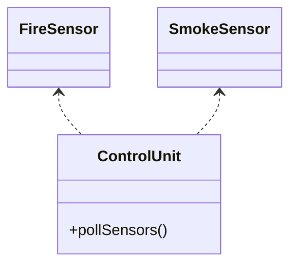

# 2.0 - Exercise 2 - Single Responsibility Principle (SRP) and Dependency Inversion Principle (DIP)

In this exercise we will look at how to apply the SOLID principles in code.

## 2.1 - Dependency Inversion Principle (DIP)

:pencil2: The `pollSensors` method on the `ControlUnit` class currently knows which sensors (`FireSensor` and `SmokeSensor`) are registered in the system. This adds a thight coupling between the `ControlUnit` and the Sensor classes.

:exclamation: We want to apply the _Dependency Inversion Principle (DIP)_ in order to make the `ControlUnit` oblivious to which type of sensor it administers.

When we introduce this kind of [loose coupling](https://en.wikipedia.org/wiki/Loose_coupling), the ControlUnit class is not prone to change as the Sensor class changes. E.g. We can add new sensor types without changing the ControlUnit class. As long as the different types of sensors adhere to the interface of how a sensor should behave. The ControlUnit class no longer has a direct dependency to the different sensor types, instead it only knows the behaviour of a sensor.

 :pencil2: Investigate the `ControlUnit.pollSensors()` method. What are its current responsibilities? (No need to do anything, just make sure you find all responsibilities before you continue). Ask an instructor if you're not sure.

## 2.2 - Inversion of Control Principle (IoCP)

:book: Instead of "newing up" sensors in a list when we call `pollSensors()`, we want to pass a collection of sensors in to the ControlUnit somehow (we want to _invert the dependencies_ between ControlUnit, pollSensors callee, and the various Sensor classes). However, we don't want to pass the sensors in when we are polling. When we poll sensors, the control unit should be configured with all of the required sensors.

:pencil2: Use Dependency Inversion by sending a _list of sensors_ in as a _constructor parameter_ when we're creating the `ControlUnit` class.

:pencil2: Investigate the pollSensors method again, same as #1. What are the responsibilities now? (Not sure? Ask an instructor!).

> :question: You didn't forget test coverage of ControlUnit or leave failing tests did you?

### 2.2.1 - Testing tips

As you try to write tests for ControlUnit.pollSensors(), you might find it frustrating that it doesn't return any value. Here's a couple of workarounds:

:star: At the moment we're just writing messages using `System.out.println` which is impossible to test. What if you made an `AlarmHandler` interface with the method `handleTriggeredSensor(Sensor sensor)` or `handleTriggeredSensor(String sensorOutput)`?
The default implementation (`ConsoleWritingAlarmHandler`? (Just suggestions...)) could then do the `System.out.println` calls as before, but in your tests you could implement a `FakeAlarmHandler` class that stores all
sensor logs in a List which you can then read and assert against in your test.

:star: Nobody said ``pollSensors`` has to return void. It's your implementation after all. If you want to return a `Map<string, string>` of sensor id's and sensor alarm messages so that it's easier to test, go for it.

### [Go to exercise 3 :arrow_right:](../exercise-3/README.md)
