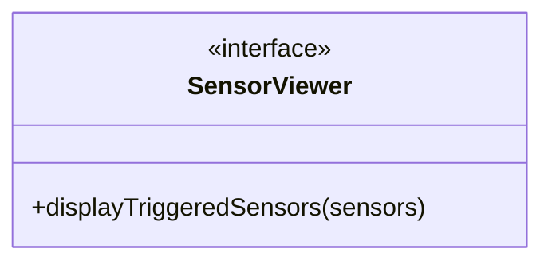
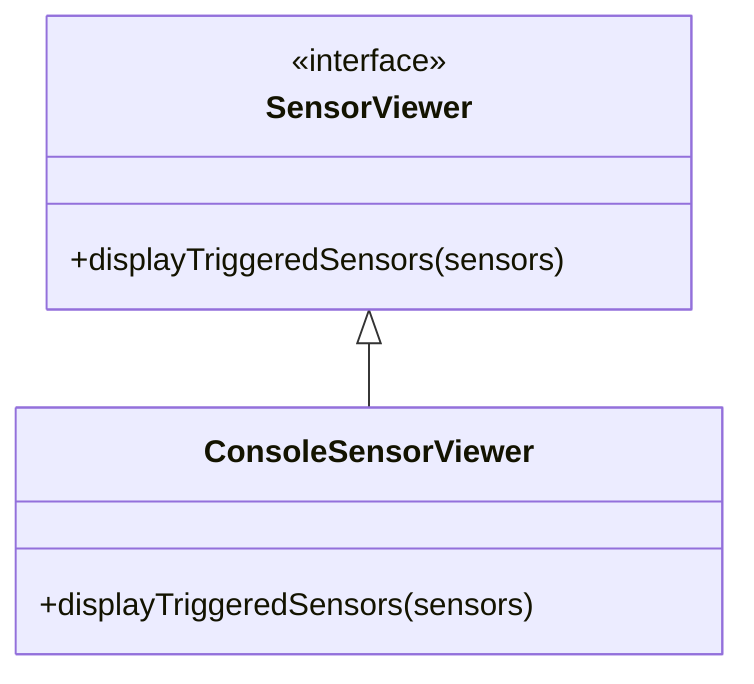
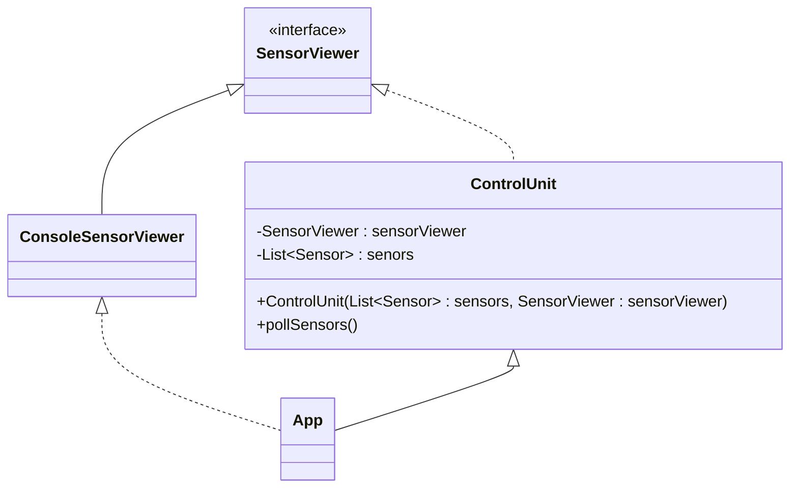

# 3.0 - Exercise 3 - Single Responsibility Principle (SRP)

:book: The Single Responsiblity Principle (SRP) states:
> A class should have only one reason to change

:question: What defines a reason to change?

:book: The principle defines a responsibility as a _reason to change_. A a class or module should have one, and only one, reason to be changed (e.g. rewritten).

:book: At this point, we have inverted the `ControlUnit`s dependency on the sensors it controls, to avoid tight coupling. Generally, we want our code to have _low coupling and high cohesion_. We want to continue using the Dependency Inversion Principle together with the Single Responsibility Principle to achieve this.

:book: High cohesion in the context of code simply means that code changes together, stays together. We can say that a module in our code should have have a clear defined purpose, and code that is related is grouped together. In this exercise, we will apply the Single Responsibility Principle (SRP), and see how we can improve our `ControlUnit` module further.

## 3.1 - Identifying responsibilites

:book: Our `ControlUnit` class currently have two responsibilities; execute business logic to poll the sensors and to display information about triggered sensors in console (the text-based user interface).

:book: The `ControlUnit::pollSensors` function currently has more than one reason to change. Imagine we wanted to change the way we displayed information about triggered sensors: We would have to re-write the display logic in the same function that handles our logic (Say we wanted the application to have a graphical user interface (GUI) instead of a text-based user interface). Additionally, we will have a hard time [unit-testing](https://en.wikipedia.org/wiki/Unit_testing) our `ControlUnit` logic in isolation, without including the view logic in our ["System under test"](https://en.wikipedia.org/wiki/System_under_test).

## 3.2 - Isolating display logic

:book: In this exercise, we will also use the Dependency Inversion Principle from exercise 1. We will start by extracting our code for displaying the trigger status of sensors in a new class.  

:pencil2: Create an interface called `SensorViewer`. This interface should have a single method `displayTriggeredSensors`, which takes a list of sensors as parameters:



:book: If you are stuck, here is an example:
<details>

```java
package nerdschool;

import java.util.List;

public interface SensorViewer {
  void displayTriggeredSensors(List<Sensor> sensors);
}
```

</details>

:pencil2: Create an implementation of the `SensorViewer` interface called `ConsoleSensorViewer`. Move the logic for printing the trigger status of the sensors from `ControlUnit` into the `ConsoleSensorViewer::displayTriggeredSensors` method.



:pencil2: Add a private instance variable of type `SensorViewer` to our `ControlUnit` class and set its value through constructor injection. In our `App` class, inject a `ConsoleSensorViewer` via the new parameter you added to `ControlUnit`. In the `ControlUnit::pollSensors()` method, Use the injected `SensorViewer` to handle displaing information about triggered sensors.

:book: The result should look like this (Sensor-related parts   omitted):



:pencil2: Check that the code still runs.

## 3.3 - Isolating business logic

Now, we have isolated our view logic. The business logic should not cause changes to our view logic, and visa verca, changes to our view logic (e.g. changing it to a GUI application) should not affect the business logic.

Still, we have business logic in our `ControlUnit` which is located closely to the orchestration of view logic. We can extract this into a separate class as well, and let the purpose of the `ControlUnit` class be orchestration of business- and view logic.

:pencil2: Create an interface called `SensorPoller`. This interface should have a single method `pollSensors()`, which returns the sensors that are currently triggered.

Example:
<details>

```java
package nerdschool;

import java.util.List;

public interface SensorPoller {
  List<Sensor> pollSensors();
}
```

</details>

:pencil2: Create an implementation of `SensorPoller` called `FakeSensorPoller` (Since we are not dealing with real sensors). This should accept a list of sensors as parameter. Assign the sensors a private instance variable, and move the logic for handling alarm triggering to its `pollSensors()` method. This function should return the sensors from the injected sensors list that is triggered.

:book: If you are stuck, here is an example:
<details>

```java
package nerdschool;

import java.util.ArrayList;
import java.util.List;

public class FakeSensorPoller implements SensorPoller {
  private final List<Sensor> sensors;

  public FakeSensorPoller(List<Sensor> sensors) {
    this.sensors = sensors;
  }

  public List<Sensor> pollSensors() {
    List<Sensor> triggeredSensors = new ArrayList<>();

    for (Sensor sensor : sensors) {
      if (sensor.isTriggered()) {
        triggeredSensors.add(sensor);
      }
    }

    return triggeredSensors;
  }
}
```

</details>

:pencil2: Adapt the `ControlUnit` class to use our `SensorPoller` interface to handle the business logic.

- Remove the injection of sensors into `ControlUnit`. `SensorPoller` should now handle this.
- Inject an instance of `SensorPoller` through constructor injection and set it as a private instance variable in our `ControlUnit`.
- Use our `SensorPoller` to poll sensors and get the triggering alarms.
- Display triggering alarms by calling the `displayTriggeredSensors` on our `SensorViewer`.

The `ControlUnit` class should look like this:

```java
package nerdschool;

import java.util.List;

public class ControlUnit {
  private final SensorViewer sensorViewer;
  private final SensorPoller sensorPoller;

  public ControlUnit(SensorViewer statusWriter, SensorPoller sensorPoller) {
    this.sensorViewer = statusWriter;
    this.sensorPoller = sensorPoller;
  }

  public void pollSensors() {
    List<Sensor> triggeredSensors = this.sensorPoller.pollSensors();
    this.sensorViewer.displayTriggeredSensors(triggeredSensors);
  }
}
```

## 3.4 - Revisiting coupling and cohesion in our updated code

### Code cohesion

In this exercise, we have split our application into separate concerns by applying the Single Responsiblity Principle and Dependency Inversion Principle.
Our `ControlUnit` class has the responsiblity to orchestrate calling business logic module and passing its result to a UI module. It is oblivious to the business logic internals or how the UI is displayed. Changes to business logic or to the view logic, should not affect how these two parts of the application are connected.

Our `SensorPoller` (implemented by `FakeSensorPoller`) does not know anything about anything other than executing sensor polling. E.g. changes to our sensors or adding sensor types does not affect how this module behaves.

Our `SensorViewer` (implemented by `ConsoleSensorViewer`) does not know anything about anything other than displaying triggered sensors.

### Code coupling

Since we have injected interfaces and not implementations of our `SensorPoller` and `SensorViewer` into our `ControlUnit`, we are free to change these implementations as we like, without changing how they are run. For example, we could replace our `SensorPoller` implementation with a real implementation polling real sensors, and our `SensorViewer` with a GUI layer, as long as they adhere to the behaviour defined in their interfaces.

### [Go to exercise 4 :arrow_right:](../exercise-4/README.md)
