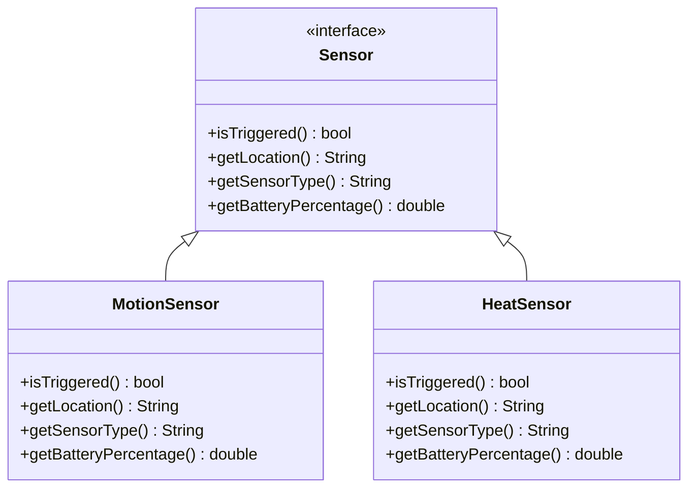
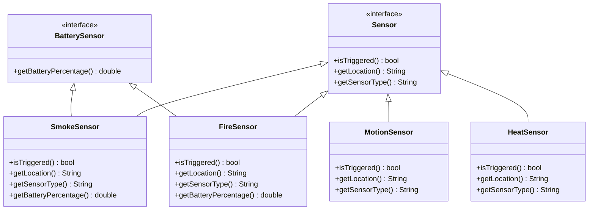

# 4.0 - Exercise 4 - Interface Segregation Principiple (ISP)

## 4.1 - Adding motion and heat sensors

:book: A new use case! This is no longer a alarm system for only detecting hazards (smoke and fire), it should now also include security sensors such as _motion_ and _heat sensors_.

:exclamation: **However, these new security sensors don't run on battery so one of the `Sensor` interface methods is suddenly redundant for a whole set of sensors.**

:pencil2: Following the Interface Segregation Principle, we can start splitting the current `Sensor` interface into more fitting ones.

:pencil2: Create a new `BatterySensor` interface. Move the `getBatteryPercentage` method from the `Sensor` interface into this new interface.

:pencil2: Make the `FireSensor` and `SmokeSensor` classes implement `BatterySensor` as well as `Sensor`.

:pencil2: Create a new `MotionSensor` sensor, which inherits from the `Sensor` interface. These new security sensors should be polled separately from the hazard sensors. This requires a way to distinguish between the two sensor categories. Make changes to the `Sensor` interface to accomodate this.

## 4.2 - Adding a time-check rule

:pencil2: Security sensors should only be polled at night between 22:00-06:00. This is the same for all security sensors. Since we don't want to mix security sensor and hazard sensor behaviour in the same polling mechanism, we decide to make use of inheritance and create a new `SecurityControlUnit` which `extends` the existing ControlUnit. Our intention is to pass in the security sensors through the _super (parent) constructor_ and then implement a rule that checks the current time and if it's between 22:00-06:00, we run the `super.pollSensors()` method which already do the heavy lifting for us.

:question: Which SOLID principle are we _maintaining/not breaking_ by doing this?

:pencil2: Create the `SecurityControlUnit` and extend `ControlUnit`
:pencil2: Implement the time-check rule and poll the sensors.

